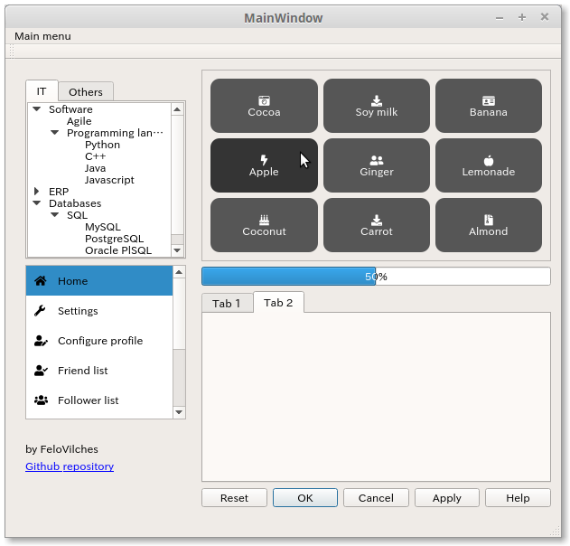

# Qt5 Examples & Templates

## Images

### Dashboard

[Dashboard template](dashboard)

  

  

## Goals

My goals on this repository:

* Create sample apps using C++ with Qt5.
* Learn more Python and create sample apps using PyQt (also move away from C++).
* Create my own components, which have custom rendering.
* Create at least one app with PyQt that has multiple views with several types of components and/or requirements, such as:
  * Graphs/charts
  * Tables
  * Loading gifs before displaying a view or data
  * Use reactive programming as the main asynchronous mechanism
  * 3D animations
  * Video player
  * `What you see is what you get` textarea editor (the ones where you can use formatting, etc)

